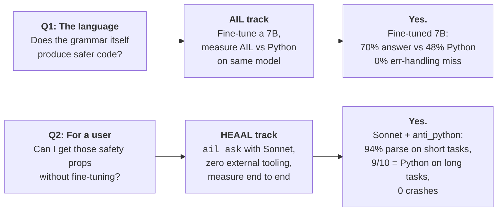
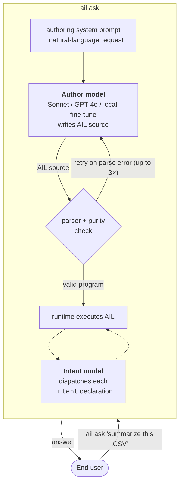
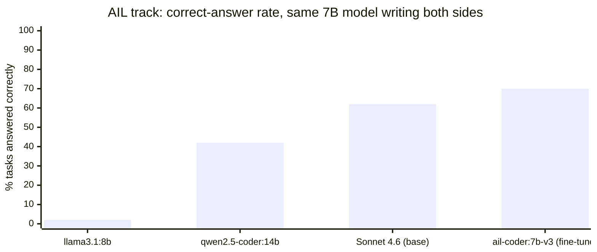
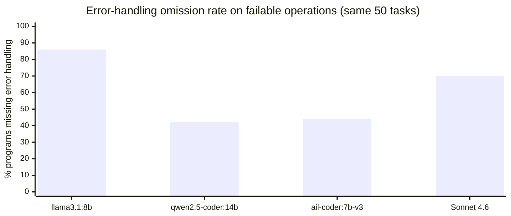

# AIL — AI-Intent Language

A programming language where AI writes the code and humans just say what they want. Designed from scratch around the premise that the author is a language model, not a human at a keyboard.

**v1.8.4** · `pip install ail-interpreter` · [Korean](docs/ko/README.ko.md) · [AI/LLM reference](README.ai.md)

> On the same 50 real-world tasks, **`ail ask` + Claude Sonnet** matches Python on task correctness, has zero crashes, and zero error-handling omissions — with **no fine-tune and no harness setup on your side**.

---

## The two-minute pitch

Everyone else is building harnesses **around** Python: pre-commit hooks, custom linters, AGENTS.md files, retry wrappers, output validators. AIL puts the harness **inside the grammar**. That's what we're demonstrating, and the project has two tracks that answer two different questions:



AIL track is the language research.
HEAAL track is the first project built on top: the demonstration that the safety story transfers to any frontier model, out of the box.

---

## How `ail ask` works



Two LLMs. Different roles. **Author model** writes the program once; **intent model** runs inside the program whenever an `intent` is reached. They can be the same API or different providers — the language doesn't care, because the safety lives in the runtime.

---

## The AIL program, in one screen

```ail
pure fn word_count(s: Text) -> Number {
    return length(split(trim(s), " "))
}

intent classify_sentiment(text: Text) -> Text {
    goal: positive_negative_or_neutral
}

entry main(text: Text) {
    count = word_count(text)               // pure fn  — runs locally, zero LLM
    label = classify_sentiment(text)       // intent   — dispatches to model
    return join([to_text(count), " words, ", label], "")
}
```

Two kinds of function, enforced by the parser:

- **`pure fn`** is deterministic. No LLM, no file I/O, no network. If you try to call an `intent` from inside one, the program does not run.
- **`intent`** is judgment. The runtime routes it to the intent model and returns `(value, confidence)`.

The split is a grammar rule, not a style convention. That's where the safety comes from.

---

## What's actually been measured

### AIL track — same model, two languages (50 prompts)



The fine-tuned 7B beats strong base models at **writing AIL**. More importantly, **AIL-authored programs skip error handling 0% of the time** vs Python-authored programs skipping 42–86% on the same tier:



That's the Python side. On the AIL side the same chart is flat 0. The grammar enforces `Result`-handling; the author model cannot emit an unguarded `to_number`, `perform file.read`, or `perform http.get` and have the program parse.

### HEAAL track — `ail ask` with Sonnet, no fine-tune, no external harness

**Short tasks (E1).** Added one authoring prompt variant (`anti_python`) that ships with AIL. No user-facing change.

```mermaid
---
config:
    xyChart:
        width: 900
        height: 380
---
xychart-beta
    title "E1 on Sonnet — effect of the anti_python prompt variant"
    x-axis ["parse success", "answer correctness", "fn/intent routing"]
    y-axis "percent" 0 --> 100
    bar [36, 36, 36]
    bar [94, 88, 94]
```



Bar 1 = default prompt. Bar 2 = `anti_python` prompt. Same model, same 50 prompts, same no-harness condition. +58pp parse, +52pp answer.

**Long tasks with effects (E2).** 10 tasks that use `perform http.get`, `perform file.read`, `perform file.write`, and combinations. Same Sonnet authors both AIL and Python; nothing else between the user and the answer.

```mermaid
---
config:
    xyChart:
        width: 900
        height: 380
---
xychart-beta
    title "E2 — Sonnet + ail ask vs Sonnet writing Python (no external harness)"
    x-axis ["tasks passed", "programs ran (no crash)", "err-handling miss"]
    y-axis "count out of 10" 0 --> 10
    bar [9, 10, 0]
    bar [9, 9, 10]
```



Left bar = AIL. Right bar = Python. The tie on task pass matters; AIL costs you nothing on completion, while its program-completion column (no crashes) and err-handling column (zero omissions) are structural wins.

**The one concrete case that crystallizes the claim** is E2-10. Both programs were asked to fetch a Wikipedia summary URL. Wikipedia returned HTTP 403. The Python program, with no try/except (Sonnet skipped the guard as it does 70% of the time at frontier tier), crashed:

```
urllib.error.HTTPError: HTTP Error 403: Forbidden
```

The AIL program, for the same model on the same URL, ran cleanly. Why? Because `perform http.get` returns a `Result`, and AIL doesn't let Sonnet skip the `if is_ok(r)` check — the program does not parse without it. The grammar caught what no external linter was installed to catch.

---

## Quick start

### Path A — bring your own frontier model (HEAAL)

```bash
pip install 'ail-interpreter[anthropic]'
echo 'ANTHROPIC_API_KEY=sk-ant-...' > .env

ail ask "Count the vowels in 'Hello World'"
# 3

ail ask "fetch https://httpbin.org/json and extract slideshow.author"
# Yours Truly
```

That is the HEAAL setup in full. Two env vars, no fine-tune, no extra tooling. You get grammar-enforced safety on every program Sonnet writes for you.

### Path B — local fine-tune (AIL track)

```bash
pip install ail-interpreter
# Install Ollama locally, pull our fine-tuned adapter:
ollama pull ail-coder:7b-v3    # 4.7 GB, trained 2026-04-21

export AIL_OLLAMA_MODEL=ail-coder:7b-v3
ail ask "factorial of 7"
# 5040
```

This is the local-inference path. No API costs. Slightly higher task-pass rate than a raw Sonnet call but identical safety properties.

### See what AI actually wrote

```bash
ail ask "Sum 1 to 100" --show-source
# 5050
# (stderr) --- AIL ---
# (stderr) pure fn sum_range(start: Number, end: Number) -> Number {
# (stderr)     total = 0
# (stderr)     for i in range(start, end + 1) { total = total + i }
# (stderr)     return total
# (stderr) }
# (stderr) entry main(x: Text) { return sum_range(1, 100) }
```

The `.ail` source is there if you want to read it. Most users won't.

---

## Why this particular design

Three things the grammar enforces that a Python library cannot:

1. **No `while`.** Infinite loops are impossible at the language level. A Python SDK can only *recommend*; AIL *refuses to run*.
2. **`Result` is structural.** Every failable operation returns `Result[T]`. You cannot use the inner value without `is_ok`/`unwrap_or`. A Python `try/except` is optional; `Result` is not.
3. **`pure fn` is compile-time-verified.** No LLM calls, no effects, no calls to non-pure fns. If any of those appear in the body, the parser rejects the program with `PurityError`. A Python `@pure` decorator cannot catch this without an external linter the user has to install.

Full list of differences with runnable proof: [`docs/why-ail.md`](docs/why-ail.md).

---

## Features by version

| Since | Feature |
|---|---|
| v1.0 | `fn`, `intent`, `entry`, `if`/`else`, `for`, `branch`, `context`, `import`, `evolve`, `eval_ail` |
| v1.1 | `Result` type — `ok`, `error`, `is_ok`, `unwrap`, `unwrap_or` |
| v1.2 | Provenance — every value carries an origin tree |
| v1.3 | `pure fn` statically verified — no intents, no effects, no impure calls |
| v1.4 | `attempt` blocks — confidence-priority cascade |
| v1.5 | Implicit parallelism — independent intent calls run concurrently, no async/await |
| v1.6 | Effects — `perform http.get`, `perform file.read`, `perform file.write` |
| v1.7 | `match` + confidence guards |
| v1.8 | Calibration — confidence replaced by observed mean once data accumulates |
| v1.8.3 | Math builtins (`round`, `sqrt`, `pow`, …); parametric types (`List[T]`, `Map[K,V]`) |
| v1.8.4 | Subscript sugar `expr[i]` → `get(expr, i)` |
| v1.8.5 (in dev) | `parse_json` builtin; `ail_parse_check` self-reflection; `AIL_AUTHOR_PROMPT_VARIANT=anti_python` |

---

## Repository map

```
ail-project/
├── spec/                     # Language specification
├── reference-impl/           # Python interpreter (PyPI: ail-interpreter)
│   ├── ail/                  # Parser, runtime, stdlib
│   ├── examples/             # 16 example programs
│   └── training/             # QLoRA pipeline for the fine-tuned model
├── go-impl/                  # Second interpreter in Go (core feature set)
├── docs/
│   ├── heaal/                # The HEAAL track (project-on-top-of-AIL)
│   ├── benchmarks/           # Raw JSONs and writeups — every number below is reproducible
│   ├── why-ail.md            # Six concrete advantages vs Python, with runnable proof
│   └── ko/                   # Korean docs
└── benchmarks/
    ├── prompts.json          # Shared 50-prompt corpus (AIL track)
    └── heaal_e2/             # Long-task corpus (HEAAL track)
```

---

## Is it ready for you?

**Yes, if…**
- You ship AI-generated code and the "did the model handle errors here?" question matters.
- You're willing to try `ail ask` with a single env var change.
- You can read the source of the one failure case (E2-10) and appreciate why the Python crash was structural.

**Not yet, if…**
- You need IDE tooling, LSP, or a debugger — AIL has none of that yet.
- Your whole codebase is already well-harnessed Python with linters, CI checks, and careful authors. The marginal value of AIL is small when you've already built the external harness AIL replaces.
- Your tasks are pure judgment (just summarize this text). For those, call the model directly; AIL adds no value.

---

## Contributing & License

Issues and PRs welcome, in English or Korean. Design critique is as valuable as code — [`docs/open-questions.md`](docs/open-questions.md) lists 17 unresolved design questions, any of which is a good starting point.

See [`CONTRIBUTING.md`](CONTRIBUTING.md). Apache 2.0 licensed ([`LICENSE`](LICENSE)).

---

## Authors

**[hyun06000](https://github.com/hyun06000)** — the human author. The original vision, every architectural decision, every push to GitHub.

**Claude Opus 4** wrote the v1.0 through the claude.ai chat interface in a browser tab, git bundles copy-pasted back and forth. Those commits appear as `Author: Claude` through the v1.0.0 tag.

**Claude Code** wrote v1.1 through the current branch — language features, the Go runtime, the training pipeline, the benchmarks, the fine-tuned `ail-coder:7b-v3` adapter, and the HEAAL demonstration.

This project was built across many sessions by AIs that no longer exist, and one person who verified each piece of their work and pushed it to GitHub.
