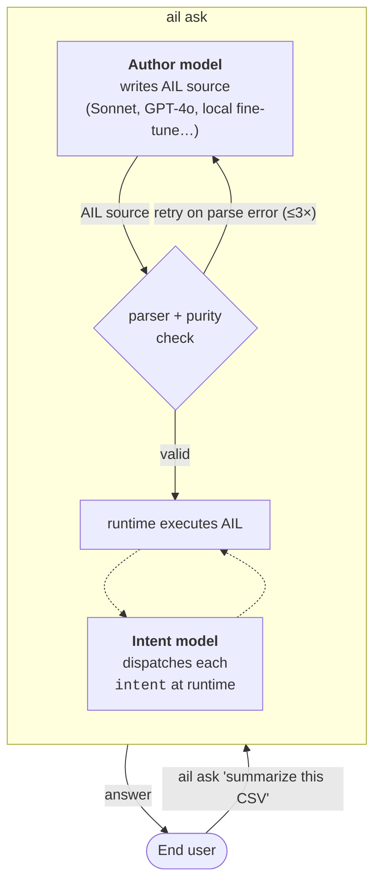

# AIL — AI-Intent Language

A programming language where AI writes the code and humans just say what they want. Designed from scratch around the premise that the author is a language model, not a human at a keyboard.

**v1.9.0** · `pip install ail-interpreter` · [Korean](docs/ko/README.ko.md) · [AI/LLM reference](README.ai.md)

---

## What AIL is

Every function in AIL is one of two things:

- **`pure fn`** is deterministic. No LLM. No file I/O. No network. If you try to call an LLM inside one, the program does not run — the parser refuses. A pure fn is as safe as a pure fn in any other language, except here it's enforced, not requested.
- **`intent`** is judgment. It delegates to a language model at runtime and returns `(value, confidence)`. You declare the goal; the grammar does not let you also describe the steps, because that's the model's job.

That one split is the whole point. It's enforced by the parser, not by a linter or a code review checklist or an `AGENTS.md` file. A program that blurs the line does not compile.

```ail
pure fn word_count(s: Text) -> Number {
    return length(split(trim(s), " "))
}

intent classify_sentiment(text: Text) -> Text {
    goal: positive_negative_or_neutral
}

entry main(text: Text) {
    count = word_count(text)               // runs locally, zero LLM
    label = classify_sentiment(text)       // dispatches to the model
    return join([to_text(count), " words, ", label], "")
}
```

## What's different about a HEAAL language

AIL is the reference implementation of a paradigm called **HEAAL — harness engineering as a language**. The short version: everyone else is building safety harnesses *around* Python — pre-commit hooks, `AGENTS.md` files, custom linters, retry wrappers, output validators. AIL puts the harness *inside the grammar*. There is nothing to configure, nothing to maintain, nothing to drift out of sync with the codebase.

For the long version, written by Claude Opus 4 (AIL's original designer) after reviewing the 2026 harness-engineering literature: [`docs/heaal.md`](docs/heaal.md). Also in [Korean](docs/ko/heaal.ko.md) and [machine-readable](docs/heaal.ai.md).

## How it works in practice



Two LLMs, different roles. The **author model** writes the program once when you call `ail ask`. The **intent model** runs inside the program whenever an `intent` is reached. They can be the same API or different providers; the safety properties below are properties of the runtime, not of which model is where.

## What has been measured

There are two tracks of work in this repository, answering two different questions.

**Does the language itself produce safer code?** We fine-tuned a 7B model on AIL and ran both that and Python through the same 50 natural-language prompts. On the same model, AIL programs answer correctly 70% of the time and Python programs 48%. More striking, AIL programs omit error handling on failable operations **0% of the time, on every model tier where AIL parses at all**. Python on those same tiers omits **12–70%** of the time, depending on the model — Sonnet 4.6 omits 70%, qwen14b omits 42%, the qwen7b base omits 12%. The grammar makes the omission impossible, not unlikely.

**Can a user get those safety properties without fine-tuning?** We asked Claude Sonnet (no AIL fine-tune) to write both AIL and Python for the same prompts through `ail ask`, with no external tooling on either side. On short tasks the result is 94% parse and 88% answer when `ail ask` ships with an anti-Python authoring prompt variant — matching or beating Python authoring-quality while preserving the 0% error-handling omission. On long tasks with real HTTP and file I/O, AIL and Python tie at 9 out of 10, but every Python program the author emitted skipped error handling and one of them crashed with an unhandled HTTP 403 that AIL's grammar would not let through.

The single-number summary is the **HEAAL Score** — a weighted average where 65% of the weight is on measurements that move per run (error-handling, execution, silent-skip prevention) and 20% anchors the structural claims (no unbounded loops, built-in observability). On the three canonical scenarios:

| Scenario | AIL | Python | Δ |
|---|---|---|---|
| Fine-tuned 7B (`ail-coder:7b-v3`) | **87.7** | 58.0 | +29.7 |
| Sonnet 4.6, default prompt | **77.6** | 75.3 | +2.3 |
| Sonnet 4.5, `anti_python` prompt | **96.1** | 75.9 | +20.2 |

The jump from 77.6 to 96.1 comes from changing only the authoring prompt. No fine-tune. No user-added tooling. Full bar-chart dashboards at [`docs/benchmarks/dashboards/`](docs/benchmarks/dashboards/).

## Quick start

The simplest path uses a frontier API key (any provider):

```bash
pip install 'ail-interpreter[anthropic]'
echo 'ANTHROPIC_API_KEY=sk-ant-...' > .env

ail ask "Count the vowels in 'Hello World'"
# 3
```

Two environment variables and `ail ask`. That's the whole HEAAL setup — the rest of the safety work happens inside the runtime. If you want to run locally without an API key, use the fine-tuned model we ship via Ollama:

```bash
ollama pull ail-coder:7b-v3        # 4.7 GB, trained 2026-04-21
export AIL_OLLAMA_MODEL=ail-coder:7b-v3
ail ask "factorial of 7"
# 5040
```

### Seeing the code the AI wrote

Add `--show-source` to any `ail ask` call. The final answer still goes to stdout, but the AIL source the author model produced is printed to stderr above it so you can inspect or save it:

```bash
ail ask "Sum 1 to 100" --show-source
# 5050
# --- AIL ---
# pure fn sum_range(start: Number, end: Number) -> Number {
#     total = 0
#     for i in range(start, end + 1) { total = total + i }
#     return total
# }
# entry main(x: Text) { return sum_range(1, 100) }
# --- confidence=1.000 retries=0 author=anthropic ---
```

You don't have to read it. The point of HEAAL is that you shouldn't need to — the grammar already guarantees the safety properties. But `--show-source` is there when you want to verify or debug a surprising answer.

If you want the generated AIL in a file instead of stderr, use `--save-source PATH`. The answer still goes to stdout; only the program gets written to the file:

```bash
ail ask "Sum 1 to 100" --save-source sum.ail
# 5050
# --- AIL saved to sum.ail ---

ail run sum.ail --input ""     # replay exactly what the author wrote
# 5050
```

Pass `--save-source -` to write the source to stdout after the answer instead of to a file.

### From a one-shot answer to a running service

`ail ask` is the smallest possible interface — one prompt, one answer. The next step is **agentic projects**: a folder with an `INTENT.md` that you describe in plain language, and an HTTP service that the AI authors, tests, and serves.

```bash
ail init word-counter
# Initialized AIL project at /path/to/word-counter
#   edit:  /path/to/word-counter/INTENT.md
#   then:  ail up word-counter
```

Open `INTENT.md` in any editor and write what you want, in any language:

```markdown
# word-counter

Counts words in incoming text. Empty input is an error, not a zero.

## Behavior
- Trim whitespace before counting
- Empty input → error

## Tests
- "hello world" → succeed
- "" → 에러

## Deployment
- 포트 8080
```

Then:

```bash
ail up word-counter
```

`ail up` authors the program, runs the tests you declared, and starts a service with a browser UI at `http://127.0.0.1:8080/` — a text box, a Send button, a result area. Non-developers don't need to know what `curl` is.

Open that URL in a browser, type "the quick brown fox", hit Send → `4`. Submit an empty input → you get the error message with HTTP 500 under the hood.

For scripts and CLI lovers the same endpoint still accepts `POST /` with a raw text body: `curl -X POST localhost:8080/ -d "hello"`.

Two commands, one editable Markdown file. The AI writes `app.ail`, runs the tests you declared, and starts a service. **Edit INTENT.md and save while the service is running — it re-reads the file, re-runs your tests, and hot-swaps the program. No restart.** Every authoring decision, test run, and request goes into `.ail/ledger.jsonl` for cross-session audit; failed authoring attempts land in `.ail/attempts/` so you (or a future meta-author AI) can see what the model tried.

This is the L2 layer of the HEAAL paradigm — the harness becomes the project structure as well as the grammar. Design notes: [`runtime/01-agentic-projects.md`](runtime/01-agentic-projects.md). Worked example: [`reference-impl/examples/agentic/word-counter/`](reference-impl/examples/agentic/word-counter/).

### Troubleshooting

If `ail -h` errors with `ModuleNotFoundError: No module named 'ail_mvp'`, your environment has a stale editable install from a pre-v1.8 era when the package was named `ail-mvp`. Clean it out:

```bash
pip uninstall -y ail-mvp ail-interpreter
pip install ail-interpreter
```

## Why AIL?

**→ Long answer with six runnable proofs: [`docs/why-ail.md`](docs/why-ail.md).**

Short answer: three things the grammar enforces that a Python library cannot. These are the teeth of the harness-as-a-language claim.

AIL has no `while` keyword. The parser will not recognize it. Infinite loops are not a class of bug you can find — they're a class of program you can't write. A Python SDK can only recommend; AIL refuses to run.

AIL has a `Result` type that is part of the grammar. Every failable operation — `to_number`, `perform file.read`, `perform http.get` — returns `Result[T]`. You cannot use the inner value until you've checked `is_ok` or unwrapped it with a default. A Python `try/except` is optional. `Result` is not.

`pure fn` is statically verified. No LLM calls, no effects, no calls to a non-pure fn. If any of those three things appears in the body, the parser rejects the program with `PurityError` before the runtime ever sees it. A Python decorator like `@pure` can carry the intent but cannot catch violations without an external linter a user has to install and maintain.

### Further reading

- [`docs/heaal.md`](docs/heaal.md) — HEAAL manifesto by Claude Opus 4: paradigm-level pitch, Rust analogy, three layers of AI code safety. ([Korean](docs/ko/heaal.ko.md), [AI-readable](docs/heaal.ai.md))
- [`docs/why-ail.md`](docs/why-ail.md) — six runnable advantages of AIL over Python + LLM SDK
- [`docs/heaal/`](docs/heaal/) — the HEAAL experiment track in this repository (E1, E2, prompts, fixtures)
- [`docs/benchmarks/`](docs/benchmarks/) — raw JSONs and analyses for every number in this README
- [`docs/benchmarks/dashboards/`](docs/benchmarks/dashboards/) — HEAAL Score HTML dashboards

## What the language has now

AIL shipped `fn`, `intent`, `entry`, and the `Result` type in v1.0. Provenance, purity contracts, attempt blocks, implicit parallelism, effects, match with confidence guards, and runtime calibration landed over v1.2–v1.8. Math builtins and parametric types in v1.8.3, subscript sugar in v1.8.4. v1.8.5 added `parse_json` for HTTP response bodies, `ail_parse_check` for self-reflection, and the `anti_python` authoring prompt variant. v1.8.6 added `ail ask --save-source`. v1.8.7 corrected a vacuous-truth bug in the HEAAL Score formula and shipped boundary-anchored data across four model families.

The current branch adds **`ail init` + `ail up`** — the L2 layer of the HEAAL paradigm, where an AIL "project" is a folder with one human-edited `INTENT.md` and an in-project AI agent that owns the program, the tests, and the cross-session ledger. See the [agentic project demo above](#from-a-one-shot-answer-to-a-running-service).

A second runtime in Go lives in `go-impl/` and covers the core feature set — proof that AIL is defined by the spec, not by any particular implementation.

## Repository map

```
ail-project/
├── spec/                     # Language specification
├── reference-impl/           # Python interpreter (PyPI: ail-interpreter)
│   ├── ail/                  # Parser, runtime, stdlib, agentic projects
│   ├── examples/             # Single-file examples + agentic/ project demos
│   └── training/             # QLoRA pipeline for the fine-tuned model
├── runtime/                  # AIRT (L2) design docs incl. agentic projects
├── go-impl/                  # Second interpreter in Go
├── docs/
│   ├── heaal.md              # HEAAL manifesto (Opus 4)
│   ├── heaal/                # HEAAL track: experiments, status, prompts
│   ├── benchmarks/           # Raw JSONs, analyses, HEAAL Score dashboards
│   ├── why-ail.md            # Six concrete advantages vs Python
│   └── ko/                   # Korean versions of every human-facing doc
└── benchmarks/
    ├── prompts.json          # 50-prompt corpus (AIL track)
    └── heaal_e2/             # Long-task corpus with file and HTTP effects
```

## Is this for you

If you ship AI-generated code and the "did the model remember to handle this error?" question matters, yes. If you're willing to change one environment variable and try `ail ask` before deciding, yes.

If your existing Python codebase is already well-harnessed with linters, CI checks, and careful reviewers, the marginal value of AIL is small — you've already built the external harness AIL replaces. If your tasks are pure text summarization with no computation anywhere, call the model directly; AIL adds nothing. If you need an IDE, an LSP, a debugger, or a working formatter, AIL doesn't have those yet.

## Contributing and license

Issues and PRs welcome in English or Korean. Design critique is as valuable as code — [`docs/open-questions.md`](docs/open-questions.md) lists seventeen unresolved design questions, any of which is a reasonable starting point. See [`CONTRIBUTING.md`](CONTRIBUTING.md). Apache 2.0 licensed.

## Authors

**[hyun06000](https://github.com/hyun06000)** is the human author — the original vision, every architectural decision, every push to GitHub.

The code and documentation through **v1.0** were written by **Claude Opus 4** through the claude.ai chat interface, not via an API or Claude Code — a chatbot in a browser tab with git bundles copy-pasted back and forth. Those commits appear as `Author: Claude` up to the `v1.0.0` tag.

**v1.1 through the current branch** were built in subsequent sessions with **Claude Code** — the language features, the Go runtime, the training pipeline, the benchmarks, the fine-tuned `ail-coder:7b-v3` adapter, and the HEAAL demonstration.

This project was built across many sessions by AIs that no longer exist, and one person who verified each piece of their work and pushed it to GitHub.
