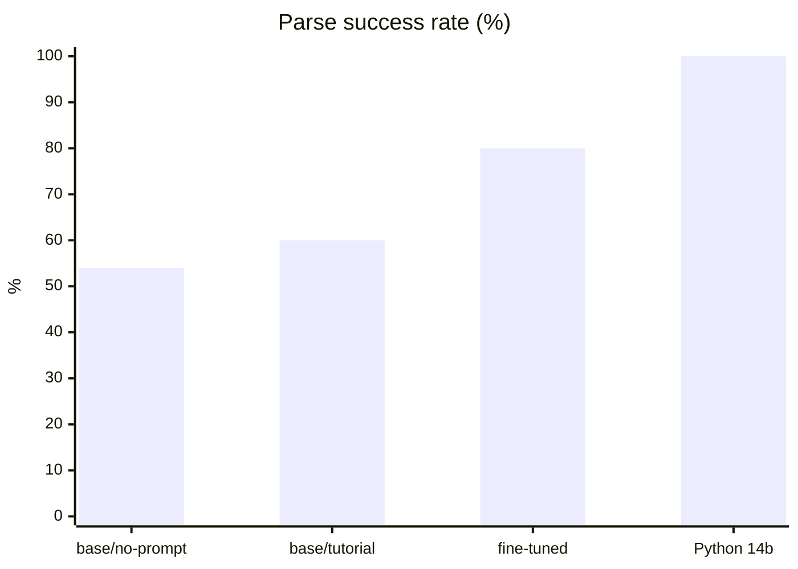
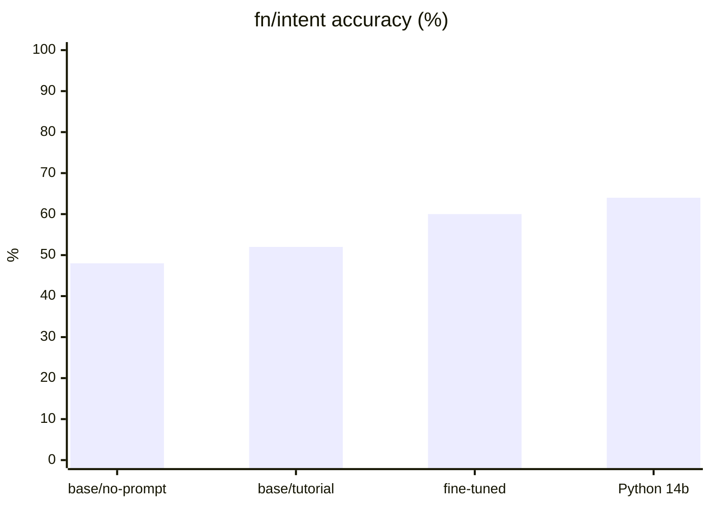
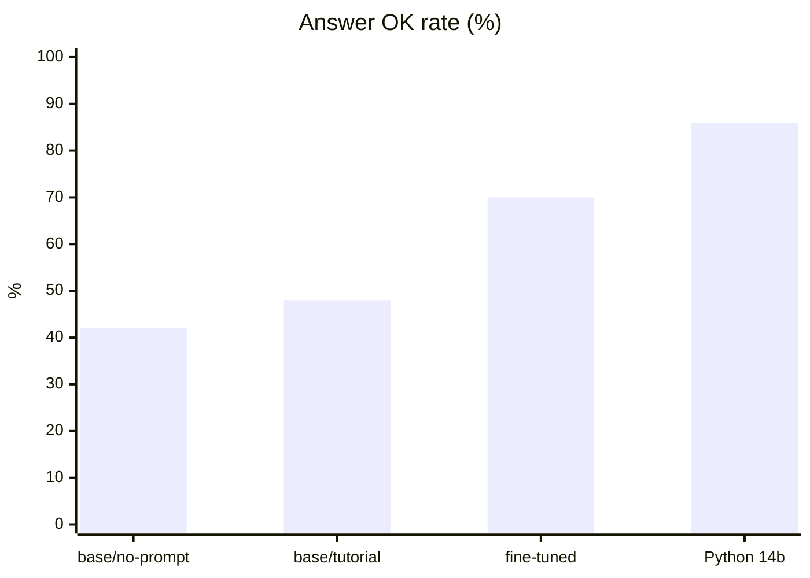
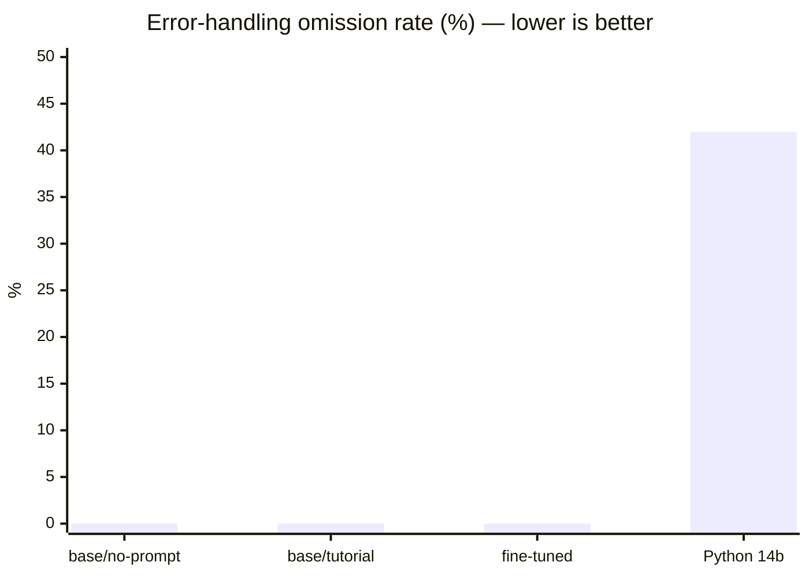
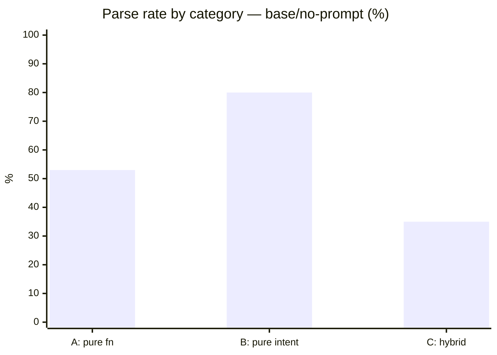
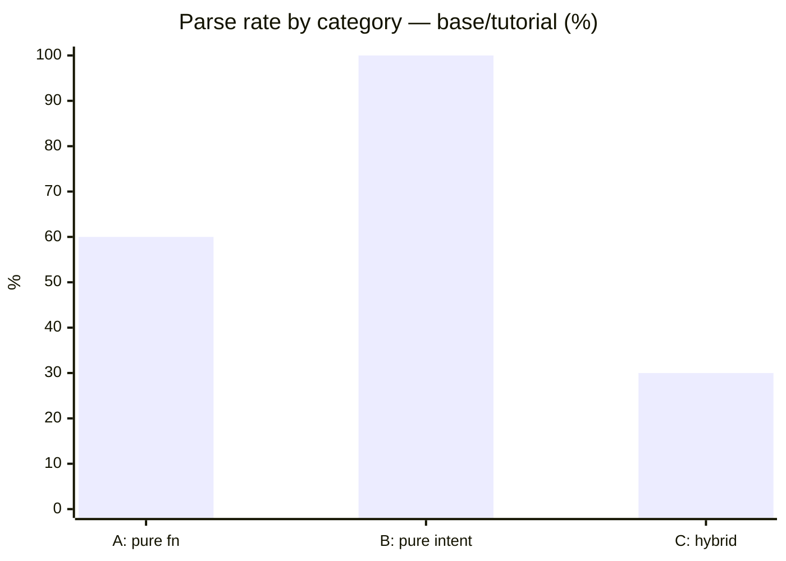
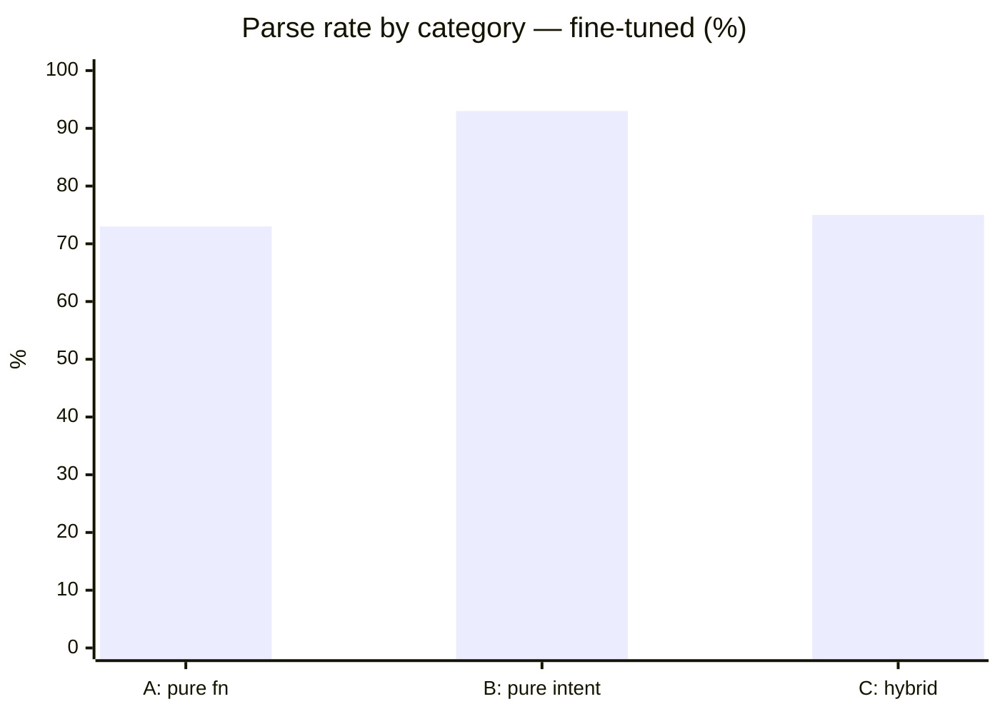
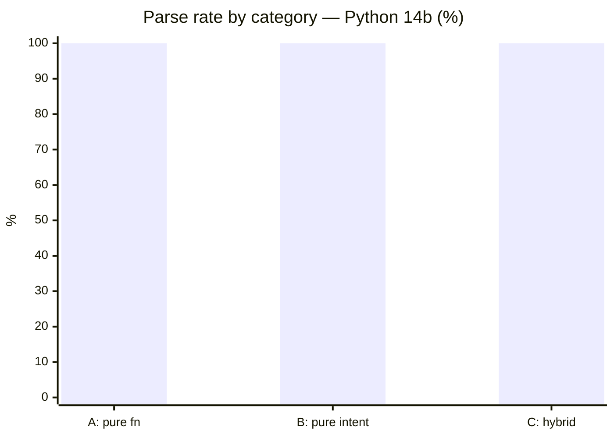
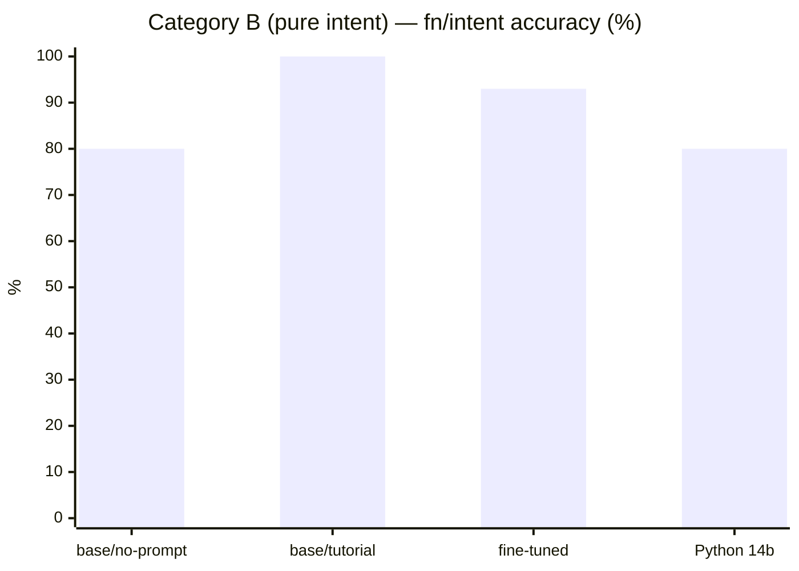
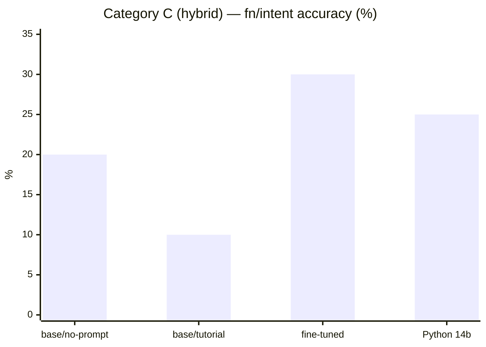

# Benchmark Overview — AIL 4-Way Comparison

**Date:** 2026-04-21  
**Corpus:** Opus 50-prompt (15 pure-fn · 15 pure-intent · 20 hybrid)

Four conditions on the same 50 tasks:

| Condition | Model | AIL prompt |
|---|---|---|
| **base / no prompt** | qwen2.5-coder:7b-base | default |
| **base / tutorial** | qwen2.5-coder:7b-base | + fn/intent decision table |
| **fine-tuned** | ail-coder:7b-v3 (QLoRA, 244 samples) | default |
| **Python 14b** | qwen2.5-coder:14b (unmodified) | Python, no AIL |

---

## Parse success rate

---

## fn/intent accuracy

Did the program use `fn` for computation and `intent` for judgment — or mix them up?

**Gap at fine-tune tier: −4pp vs Python 14b.** The prior measurement (−16pp) was artefactual — the Python side had been written by the same fine-tuned 7B model whose Python capability was partially degraded by QLoRA training.

---

## Answer correctness

---

## Error-handling omission rate

% of programs with a failable operation that skip error handling entirely.  
AIL's `Result` type makes this structurally impossible. Python leaves it optional.

**All three AIL conditions: 0%.** This is a language property — not a model or prompt effect. The qwen14b Python baseline (the strongest Python model tested) still omits error handling on 42% of failable operations.

---

## Category breakdown — parse

---

## Category B — fn/intent accuracy (pure intent tasks)

This is where AIL's structural guarantee shows most clearly.  
On pure intent tasks, Python models sometimes replace a required LLM call with keyword matching or heuristic logic — the "silent LLM skip" AIL prevents by grammar.

**AIL fine-tune (93%) and base+tutorial (100%) both beat Python 14b (80%).**

---

## Category C — hybrid tasks

Hybrid tasks (fn computation + intent judgment interleaved) are hard for every condition.  
No clear winner; both AIL and Python struggle to correctly split work between fn and intent.

This is the primary remaining challenge. Category C requires correctly identifying which subtasks need LLM judgment — a decomposition problem that neither the tutorial prompt nor fine-tuning has solved at this scale.

---

## Summary table

| Metric | base/no-prompt | base/tutorial | fine-tuned | Python 14b |
|---|---|---|---|---|
| Parse success | 54% | 60% | **80%** | 100% |
| fn/intent accuracy | 48% | 52% | **60%** | 64% |
| Answer OK | 42% | 48% | **70%** | 86% |
| **Error-handling miss** | **0%** | **0%** | **0%** | **42%** |
| Cat A parse | 53% | 60% | 73% | 100% |
| Cat B parse | 80% | **100%** | 93% | 100% |
| Cat C parse | 35% | 30% | **75%** | 100% |
| Cat B fn/intent | 80% | **100%** | 93% | 80% |
| Cat C fn/intent | 20% | 10% | 30% | 25% |

### What each condition proves

**base / no prompt → base / tutorial (+6pp parse, +20pp cat B)**  
The fn/intent decision table in the tutorial prompt is load-bearing for base models.  
Category B (pure intent) reaches 100% parse — the decision table tells the model exactly when to use `intent`.

**base / tutorial → fine-tuned (+20pp parse, cat C 30%→75%)**  
Fine-tuning provides what prompt engineering cannot: correct AIL syntax in category C (hybrid tasks).  
The decision table helps with fn/intent choice; fine-tuning teaches the grammar to interleave them.

**fine-tuned AIL vs Python 14b**  
- Parse: −20pp (AIL behind — Python is in training data; AIL needs fine-tuning)  
- fn/intent: −4pp (statistical tie, especially given 7B vs 14B model size)  
- **Error-handling: +42pp (language property — model size cannot close this gap)**  
- Category B fn/intent: **+13pp** (AIL wins — `intent` declaration prevents silent LLM skips)

---

## Related files

| File | What it covers |
|---|---|
| [`2026-04-21_vllm_qwen7b-base_promptab_baseline.json`](2026-04-21_vllm_qwen7b-base_promptab_baseline.json) | base / no prompt raw data |
| [`2026-04-21_vllm_qwen7b-base_promptab_tutorial.json`](2026-04-21_vllm_qwen7b-base_promptab_tutorial.json) | base / tutorial raw data |
| [`2026-04-21_ail-coder-7b-v3-rebench-v1.8.4_opus50.json`](2026-04-21_ail-coder-7b-v3-rebench-v1.8.4_opus50.json) | fine-tuned raw data |
| [`2026-04-21_qwen14b_promptab_baseline.json`](2026-04-21_qwen14b_promptab_baseline.json) | Python 14b raw data |
| [`2026-04-21_qwen7b-base_promptab_analysis.md`](2026-04-21_qwen7b-base_promptab_analysis.md) | tutorial A/B analysis |
| [`2026-04-21_g2_fair_comparison_analysis.md`](2026-04-21_g2_fair_comparison_analysis.md) | G2 fair comparison analysis |
