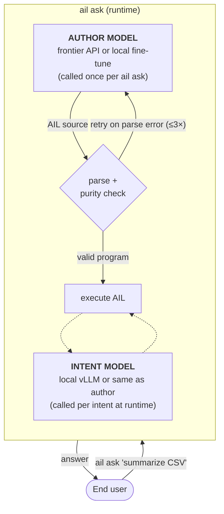

# HEAAL track — experimental demonstration

This directory is where the HEAAL project track lives inside the AIL repository: status, experiments, prompts, benchmarks. For the paradigm-level manifesto ("what HEAAL is and why it matters") written by Claude Opus 4 after reviewing the 2026 harness-engineering literature, read [`../heaal.md`](../heaal.md). Also in [Korean](../ko/heaal.ko.md) and [machine-readable](../heaal.ai.md).

The thesis being tested in this track: **AIL's safety properties hold end-to-end when a frontier base model is the authoring backend, without any external harness work on the end-user's part.** When you type `ail ask "do X"` and the authoring backend is Sonnet, you get the same grammar-level safety guarantees as if you'd fine-tuned a 7B — not because you configured linters, not because you wrote an `AGENTS.md`, not because you post-process the output, but because the safety lives in the grammar the model is writing in.

## Two LLMs, two roles

A single `ail ask` call involves up to two distinct language models in different roles, and conflating them is the first failure mode of any conversation about HEAAL.

The **author model** writes AIL source. Called exactly once per `ail ask` invocation, given the end user's natural-language request plus the AIL authoring system prompt. This is the role that a frontier API model like Sonnet or GPT-4o plays — without any fine-tuning. Configured by the `AIL_AUTHORING_BACKEND` environment variable and the backend-specific model variable.

The **intent model** evaluates `intent` declarations at runtime. Called zero or more times per program execution — once for each `intent` call the running program reaches. This role is typically filled by a cheaper local model (vLLM + a small Llama) so inference is free and user data doesn't leave the machine.

A realistic HEAAL deployment has the author model on a frontier API and the intent model on a local GPU. That's cheaper and safer than "one model does everything": the expensive API call happens once per user request (authoring), while the inner judgment calls run locally.

The safety properties HEAAL demonstrates — zero error-handling omission, no silent skip of declared intents, no unbounded loops, pure-fn isolation — are properties of the *runtime*, enforced by the grammar. They are independent of which specific model plays either role. That is the whole point.

## What HEAAL is NOT

HEAAL is not a benchmark of the author model's AIL-writing skill. That's an AIL-track question. HEAAL doesn't care how good Sonnet is at emitting AIL syntax — the retry loop in `ail ask` is allowed to spend a few extra tokens getting the author model to produce something valid. What HEAAL cares about is what the user ultimately *receives*.

HEAAL is not an evaluation of AIL. The language is assumed. HEAAL is the downstream question: given AIL + a strong base author model + no external harness, does the end-to-end pipeline deliver its safety properties?

HEAAL is not a prompt-engineering contest. Prompt variants like `anti_python` ship with AIL; they are part of the language-level harness, not user-written external tooling.

## E1 — short tasks

The first experiment runs the shared 50-prompt corpus through `ail ask` with Claude Sonnet as the author and an Anthropic API key as the intent backend, no external tooling on either side. Two prompt variants were tested: the default authoring prompt and `anti_python`, a front-loaded variant that opens with a block of "these patterns will fail parse" rather than a positive description.

On the default prompt, Sonnet parses AIL 36% of the time and answers correctly 36% of the time — well below the Python-gen baseline (~62% answer) but with 0% error-handling omission. On `anti_python`, the same Sonnet reaches 94% parse and 88% answer, matching or beating Python authoring-quality without changing the safety column. The full writeup: [`2026-04-22_heaal_E1_analysis.md`](../benchmarks/2026-04-22_heaal_E1_analysis.md).

The headline is not that the prompt variant exists — it's that changing only the authoring prompt lifts a frontier base model from 36% to 94% parse success with no fine-tuning anywhere. The safety properties stayed at 0% omission under both prompts because those come from the grammar.

## E2 — long tasks with effects

The second experiment stresses the same setup with ten tasks that use `perform http.get`, `perform file.read`, `perform file.write`, and combinations — the kinds of real-world pipelines where Python stacks need the most external harness work.

Both AIL and Python passed 9 of 10 tasks. Both were authored by the same Sonnet with the same no-harness setup. Where the two differ is off the pass/fail column: every Python program the author emitted had at least one failable operation without a `try/except`, while every AIL program had the corresponding `is_ok` check because the grammar refused to parse programs that skipped it. And the one case where that mattered — E2-10, where Wikipedia returned HTTP 403 — the Python program crashed with an uncaught `urllib.error.HTTPError` while the AIL program returned a graceful error message.

The full writeup: [`2026-04-22_heaal_E2_analysis.md`](../benchmarks/2026-04-22_heaal_E2_analysis.md). Python's 100% error-handling-omission rate is a loaded die; E2-10 is the case where it rolled.

## What ships with AIL as part of HEAAL

Three language-level artifacts support the HEAAL claim and now live in the reference implementation, not as separate tooling:

- **`AIL_AUTHOR_PROMPT_VARIANT=anti_python`** — the authoring prompt that drove the E1 lift. Concise, negative-first ("these patterns fail parse"), fights the author model's Python pretraining prior directly.
- **`parse_json(body) -> Result[Any]`** — pure builtin so programs can read HTTP bodies without line-scanning JSON. Added after E2-02 showed Sonnet doing exactly that line-scan and failing.
- **`ail_parse_check(source) -> Result[Text]`** — pure self-reflection primitive that validates AIL source without executing it. Lets AIL programs reason about other AIL programs.

None of these requires setup or configuration. They're part of what the user gets by installing `ail-interpreter`.

## File naming convention

HEAAL benchmark artifacts use the `heaal_` prefix under `docs/benchmarks/`:

- `2026-04-22_heaal_E1_sonnet_anti_python.json` — raw run
- `2026-04-22_heaal_E1_analysis.md` — writeup

AIL-track benchmarks use a bare date or `ail_` prefix. The three HEAAL Score dashboards (two HEAAL scenarios, one AIL-track baseline) live under [`docs/benchmarks/dashboards/`](../benchmarks/dashboards/).

## Current status

E1 and E2 have both cleared their targets. The core HEAAL claim — no fine-tune, no external harness, frontier author writes safe AIL reliably, at zero cost on task completion — is demonstrated on our corpus. Candidate next experiments are E3 (chain-of-thought planning in the prompt) and E4 (tool-use authoring, where the author calls `declare_pure_fn` / `declare_intent` instead of writing AIL text directly). Neither is urgent; both are refinements.
