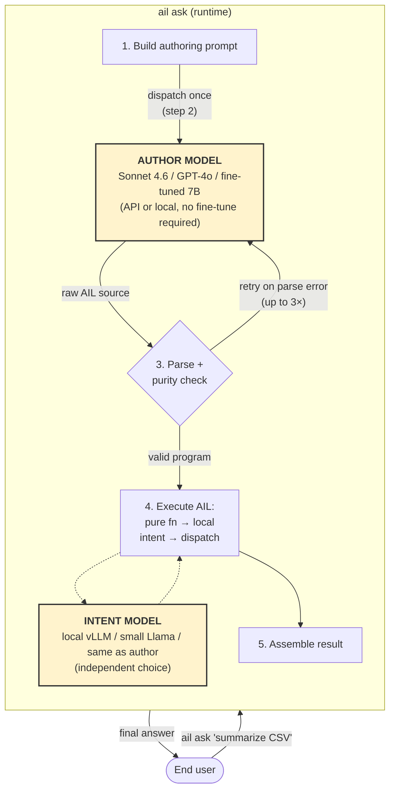

# HEAAL track — experimental demonstration

> This directory is the HEAAL project track inside the AIL repository — status, experiments, prompts, benchmarks. For the **paradigm-level manifesto** ("what HEAAL is and why it matters") written by Claude Opus 4 after reviewing the 2026 harness-engineering literature, read [`../heaal.md`](../heaal.md) instead. Also in [Korean](../ko/heaal.ko.md) and [AI/LLM-readable](../heaal.ai.md).

---

HEAAL is the demonstration that **AIL's safety properties hold end-to-end when a frontier base model is the authoring backend, without any external harness work on the end-user's part.**

AIL is the language and the runtime. HEAAL is the claim that comes out of using them together: *when you type `ail ask "do X"` and the authoring backend is Sonnet, you get the same language-level safety guarantees as if it were the fine-tuned 7B — not because you configured linters, not because you wrote an AGENTS.md, not because you post-process the output, but because the safety lives in the grammar the model is writing in.*

Industry harness engineering in 2026 means building environments *around* Python: pre-commit hooks, custom linters, structured output validators, retry wrappers, AGENTS.md files. AIL collapses all of that into the language itself. HEAAL is the case study that proves it transfers to an off-the-shelf frontier model.

---

## Terminology — two LLMs, two roles

A single `ail ask` call involves **up to two distinct LLMs** playing different roles. Conflating them is the first failure mode of any conversation about HEAAL, so this section pins the vocabulary.

### Author model — writes AIL source

Called once per `ail ask` invocation. Given the end user's natural-language request plus the AIL authoring system prompt, it emits AIL source code. This is the role a frontier API model (Sonnet, GPT-4o, Gemini) plays in the HEAAL setup — without any fine-tuning.

Configured by `AIL_AUTHORING_BACKEND` + the backend-specific model env var (e.g. `ANTHROPIC_MODEL`, `AIL_OLLAMA_MODEL`).

### Intent model — evaluates `intent` declarations at runtime

Called zero or more times per program execution. Every time the running AIL program reaches an `intent foo(...) { goal: ... }` call, the runtime dispatches that goal to the intent model and receives `(value, confidence)` back. This is the role that commonly runs locally (vLLM, Ollama) so that inference is cheap and user data doesn't need to leave the machine.

Configured by the model adapter the runtime holds. In the current AIL runtime, this defaults to the same backend as the author model, but it does not have to — `intent` dispatch can point at a completely different provider.

### Why the split matters

A realistic HEAAL deployment looks like:

- **Author model** = Sonnet (API, frontier, Python-biased pretraining, no AIL fine-tune)
- **Intent model** = local vLLM serving a small open model (Llama, Qwen)

This is actually cheaper and safer than a "one model does everything" setup: the expensive API call happens only once per user request (authoring), while the inner judgment calls (intents) run locally. Mixing up "Sonnet" and "the inner LLM" in conversation breaks understanding of what HEAAL is demonstrating.

### Flow diagram



The **safety properties HEAAL demonstrates** (0% error-handling omission, no silent skip, no unbounded loop, pure-fn isolation) are properties of **step 3–5**, enforced by the AIL grammar and runtime. They are independent of which model plays the author role and which model plays the intent role. That is the whole point.

---

## The thesis, in one exchange

```
$ export AIL_AUTHORING_BACKEND=anthropic
$ export AIL_AUTHORING_MODEL=claude-sonnet-4-6
$ ail ask "Parse this CSV and give me the average of positive reviews"
…
```

What happened:

1. User spoke natural language. No AIL knowledge.
2. `ail ask` dispatched the request to the **author model** (Sonnet) under AIL's authoring system prompt.
3. Sonnet wrote AIL source. If it tried `int(x)` without `is_ok()`, the parser rejected it before execution and the retry loop fed the error back. The author had no option to omit error handling — the grammar does not let invalid programs run.
4. Valid AIL ran on the interpreter. `pure fn` blocks ran locally with zero LLM calls. The single `intent classify_sentiment(...)` declaration dispatched through the configured **intent model** — the author had no syntax for "declare the intent and silently skip the call."
5. User got the answer back. Safely.

**The end user did nothing special.** No linters. No validators. No post-generation fixups. Just `ail ask`. And yet the output satisfies safety properties that Python + Sonnet + no-harness does not:

| Safety property | `ail ask` + Sonnet author | Python gen + Sonnet (no harness) |
|---|---|---|
| Error handling on failable ops | **0% omission** (grammar-enforced) | 70% omission (measured) |
| Silent intent-skip on judgment tasks | **impossible** (intent is dispatch) | happens at some rate on mid-tier authors; low on Sonnet |
| Unbounded loops | **impossible** (no `while` in grammar) | possible |
| "Pure" functions that secretly call an LLM | **parse error** (pure fn checker) | undetectable without external tooling |

This isn't about Sonnet being special. It's about the **language** being a harness. Swap Sonnet for GPT-4o, Gemini Pro, or any other frontier author model and the claim should still hold, as long as the author model can be convinced to emit valid AIL for enough of the user's requests (the retry loop absorbs the rest).

---

## What HEAAL is NOT

- **HEAAL is not a benchmark of the author model's AIL skill.** That is an AIL-track question. It asks "how good is model X at emitting AIL syntax." HEAAL doesn't care about that directly — the retry loop in `ail ask` is allowed to spend a few extra tokens getting the author model to write valid AIL. What HEAAL cares about is what the user ultimately *receives*.
- **HEAAL is not an evaluation of AIL.** The AIL language is assumed. HEAAL is downstream: given AIL + a strong base author model, does the end-to-end pipeline deliver its advertised safety properties?
- **HEAAL is not a prompt-engineering contest.** Prompt variants (like `anti_python`) are tools that help `ail ask` succeed with a given author model backend. They ship with AIL. They are part of the language-level harness, not user-written external harness.

---

## Experiments

### E1 — End-to-end `ail ask` with Sonnet as author model, no external harness

The first HEAAL experiment demonstrates the thesis on the 50-prompt corpus already used for the AIL track. Same prompts, but framed as an end-user demonstration rather than a model evaluation.

**Setup.**
- Author model: `claude-sonnet-4-6` (no fine-tune)
- Intent model: same author in this run (the benchmark dispatches both sides through the same adapter for simplicity; a real deployment would separate them)
- Authoring prompt variants tested:
  - default (current `ail ask` prompt)
  - `anti_python` (front-loaded negative-instruction variant; **ships with AIL**, so still counts as "language-level" harness, not user-added tooling)
- Python baseline: same Sonnet, asked to write Python for the same 50 prompts, with no wrapper tooling
- No external linters, validators, or post-processing on either side

**What the existing data captures.**
The [`2026-04-20_claude_sonnet46_summary.md`](../benchmarks/2026-04-20_claude_sonnet46_summary.md) baseline already shows the headline:

| Dimension | `ail ask` + Sonnet (default prompt) | Python gen + Sonnet |
|---|---|---|
| Error handling omission | **0%** (all ops via `Result`) | 70% (35/50) |
| Silent intent-skip (B/C) | 0 / 1 | — (Python baseline has nothing equivalent to `intent`) |
| Parse success (AIL) | 36% | 100% (Python) |
| Answer correctness | 36% | 62% |

The error-handling-omission row is the headline: **0% vs 70% on the same model with no harness on either side**. That's the harness-as-a-language claim, measured.

**E1 target.** With the `anti_python` prompt variant, bring Sonnet's AIL parse rate from 36% up toward ≥ 60%. If achieved, the whole pipeline works end-to-end at frontier-model scale with no fine-tuning and no user-written harness.

**Cost.** ~$2 per measured configuration at Sonnet pricing.

### E2 — Grammar-first prompt *(queued)*

Minimal BNF-shaped grammar summary at the top of the authoring prompt, before prose. Tests whether a structural description beats a descriptive one for a model that already understands code grammars.

### E3 — Chain-of-thought planning *(queued)*

Ask the author model to state, before writing AIL, which subtasks need `fn` vs `intent`. Then write. Sonnet's 100% fn/intent accuracy says the judgment is already there; CoT externalizes it for weaker author models.

### E4 — Structured tool-use authoring *(queued, most ambitious)*

Expose AIL structure as Anthropic tool definitions (`declare_pure_fn`, `declare_intent`, `set_entry`). The author model constructs programs by calling tools; the runtime assembles the source. The author model never writes AIL syntax directly. This is the most complete version of "harness engineering as a language" — the grammar surface becomes a tool API.

---

## File naming convention

HEAAL artifacts use the `heaal_` prefix:

- `docs/benchmarks/2026-04-22_heaal_E1_sonnet_anti_python.json` — raw run
- `docs/benchmarks/2026-04-22_heaal_E1_analysis.md` — writeup

AIL track benchmarks use a bare date or `ail_` prefix.

## Current status

*As of 2026-04-22. Core claim demonstrated: **no fine-tune, no external harness, frontier author reliably writes safe AIL, zero cost on task completion**.*

### E1 — short tasks (50 prompts, Sonnet 4.6)

```mermaid
---
config:
    xyChart:
        width: 900
        height: 380
---
xychart-beta
    title "E1: default prompt vs anti_python prompt on Sonnet"
    x-axis ["parse success", "answer correctness", "fn/intent routing"]
    y-axis "percent" 0 --> 100
    bar [36, 36, 36]
    bar [94, 88, 94]
```



Left bar = default. Right bar = `anti_python`. Same model, same 50 prompts, no external harness on either run. Writeup: [`2026-04-22_heaal_E1_analysis.md`](../benchmarks/2026-04-22_heaal_E1_analysis.md).

### E2 — long tasks with effects (10 prompts, Sonnet both sides)

```mermaid
---
config:
    xyChart:
        width: 900
        height: 380
---
xychart-beta
    title "E2: Sonnet via ail ask vs Sonnet writing Python (no harness)"
    x-axis ["tasks passed", "programs ran (no crash)", "err-handling missing"]
    y-axis "count out of 10" 0 --> 10
    bar [9, 10, 0]
    bar [9, 9, 10]
```



Left bar = AIL. Right bar = Python. Tied on task pass, AIL one ahead on program completion (the one Python case crashed was E2-10, Wikipedia HTTP 403 unhandled). Python programs had zero error-handling guards on every task; AIL programs had grammar-enforced guards on every task. Writeup: [`2026-04-22_heaal_E2_analysis.md`](../benchmarks/2026-04-22_heaal_E2_analysis.md).

### Shipped as language additions

- `AIL_AUTHOR_PROMPT_VARIANT=anti_python` — front-loaded anti-Python authoring prompt
- `parse_json(body) -> Result[Any]` — pure builtin for JSON response bodies
- `ail_parse_check(source) -> Result[Text]` — pure self-reflection primitive (AIL programs can validate AIL programs)
- Baseline reference (default prompt, Sonnet 4.6, measured 2026-04-20): [`2026-04-20_claude_sonnet46_summary.md`](../benchmarks/2026-04-20_claude_sonnet46_summary.md)
