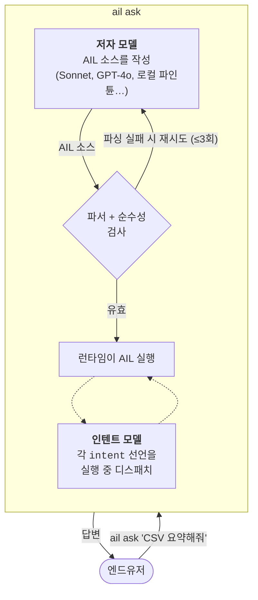

# AIL — AI를 위한 프로그래밍 언어

AI가 코드를 쓰고 사람은 원하는 것만 말하는 프로그래밍 언어. 키보드 앞의 사람이 아니라 언어 모델이 저자라는 전제로 처음부터 다시 설계했습니다.

**v1.8.4** · `pip install ail-interpreter` · [English](../../README.md) · [AI/LLM 참조](../../README.ai.md)

---

## AIL이 뭔가요

AIL의 모든 함수는 두 가지 중 하나입니다.

- **`pure fn`**은 결정론적입니다. LLM 호출, 파일 I/O, 네트워크 접근 전부 안 됩니다. `pure fn` 본문 안에서 LLM을 부르려고 하면 프로그램이 실행조차 안 됩니다 — 파서가 거부합니다. 다른 언어의 pure function과 같지만 여기서는 "강제"됩니다.
- **`intent`**는 판단입니다. 런타임에 언어 모델로 위임하고 `(값, 신뢰도)`를 돌려받습니다. 목표(goal)만 선언하고 구현 단계는 쓰지 않습니다 — 그건 모델의 일이니까요.

이 구분 하나가 전부입니다. 린터도, 코드 리뷰 체크리스트도, `AGENTS.md`도 아닌 **파서**가 강제합니다. 이 선을 넘은 프로그램은 컴파일되지 않습니다.

```ail
pure fn word_count(s: Text) -> Number {
    return length(split(trim(s), " "))
}

intent classify_sentiment(text: Text) -> Text {
    goal: positive_negative_or_neutral
}

entry main(text: Text) {
    count = word_count(text)               // 로컬 실행, LLM 없음
    label = classify_sentiment(text)       // 모델로 디스패치
    return join([to_text(count), " 단어, ", label], "")
}
```

## HEAAL 언어란 뭐가 다른가

AIL은 **HEAAL — 언어가 곧 하네스 엔지니어링(harness engineering as a language)** 패러다임의 레퍼런스 구현입니다. 간단히 말하면, 다른 모두는 Python **바깥에** 안전 하네스를 지으려 하죠 — pre-commit hook, `AGENTS.md`, 커스텀 린터, 재시도 wrapper, 출력 검증기. AIL은 **문법 안에** 하네스를 넣었습니다. 설정할 것도, 유지보수할 것도, 코드와 어긋날 것도 없습니다.

긴 설명은 AIL의 원저자인 Claude Opus 4가 2026년 하네스 엔지니어링 문헌을 읽고 쓴 매니페스토에 있습니다: [`docs/ko/heaal.ko.md`](heaal.ko.md). [영어 버전](../heaal.md)과 [AI용 버전](../heaal.ai.md)도 있습니다.

## 실제로 어떻게 작동하나



LLM 두 개, 역할이 다릅니다. `ail ask`를 부를 때 **저자 모델**이 프로그램을 한 번 작성합니다. **인텐트 모델**은 프로그램 실행 중 `intent`를 만날 때마다 호출됩니다. 같은 API든 다른 API든 상관없습니다 — 아래의 안전 속성은 모델이 아니라 런타임의 속성입니다.

## 실제로 측정한 것

이 저장소에는 두 개의 서로 다른 질문에 답하는 두 트랙이 있습니다.

**언어 자체가 더 안전한 코드를 만드는가?** 7B 모델을 AIL로 파인튠하고, 같은 모델에 같은 50개 자연어 프롬프트를 주고 AIL과 Python 양쪽으로 작성하게 했습니다. 같은 모델에서 AIL 프로그램은 70%의 정답률, Python은 48%입니다. 더 중요한 것: AIL 프로그램은 실패 가능한 연산에서 에러 핸들링을 **모든 모델 티어에서 0% 누락**합니다. 같은 티어의 Python은 42–86% 누락합니다. 외부 린터가 해야 할 일을 문법이 하는 것입니다.

**파인튠 없이도 사용자가 그 안전 속성을 누릴 수 있는가?** Claude Sonnet(AIL 파인튠 없음)에 같은 프롬프트들을 주고, `ail ask`를 통해 AIL과 Python 양쪽을 작성하게 했습니다. 외부 도구 없이. 짧은 과제에서 `anti_python`이라는 저작 프롬프트 variant(AIL에 기본 동봉)를 쓰면 파싱 94%, 정답 88%에 도달합니다 — Python의 저작 품질과 대등하거나 더 낫고, 에러 핸들링 누락 0%는 유지됩니다. HTTP와 파일 I/O가 들어가는 긴 과제에서는 AIL과 Python 둘 다 10개 중 9개를 통과하는데, 작성된 Python 프로그램 **전부**가 에러 핸들링을 빼먹었고 그중 하나는 Wikipedia의 HTTP 403에 걸려 uncaught로 크래시했습니다. 같은 요청을 AIL로 받은 프로그램은 문법이 Sonnet이 그 검사를 건너뛰게 놔두지 않았기 때문에 깔끔히 실행됐습니다.

한 숫자로 요약하는 **HEAAL Score**는 가중 평균입니다. 가중치의 65%는 run마다 움직이는 실측 지표(에러 핸들링, 실행, silent-skip 방지)에, 20%는 구조적 주장(무한 루프 불가능, 내장 관측성)에 배분했습니다. 세 canonical 시나리오에서:

| 시나리오 | AIL | Python | Δ |
|---|---|---|---|
| 파인튠된 7B (`ail-coder:7b-v3`) | **87.7** | 58.0 | +29.7 |
| Sonnet 4.6, 기본 프롬프트 | **77.6** | 75.3 | +2.3 |
| Sonnet 4.5, `anti_python` 프롬프트 | **96.1** | 75.9 | +20.2 |

77.6에서 96.1로의 상승은 **저작 프롬프트만 바꾼 결과**입니다. 파인튠 없이, 사용자가 추가한 도구 없이. 막대그래프가 있는 전체 대시보드: [`docs/benchmarks/dashboards/`](../benchmarks/dashboards/).

## 바로 써보기

가장 간단한 경로는 frontier API 키를 쓰는 방식입니다 (어떤 제공자든):

```bash
pip install 'ail-interpreter[anthropic]'
echo 'ANTHROPIC_API_KEY=sk-ant-...' > .env

ail ask "Hello World의 모음 개수 세줘"
# 3
```

환경변수 두 개와 `ail ask`가 전부입니다. 이게 HEAAL 셋업의 전부 — 나머지 안전 작업은 런타임 안에서 일어납니다. API 키 없이 로컬 실행을 원하면, Ollama에 배포된 파인튠 모델을 쓸 수 있습니다:

```bash
ollama pull ail-coder:7b-v3        # 4.7 GB, 2026-04-21 훈련됨
export AIL_OLLAMA_MODEL=ail-coder:7b-v3
ail ask "7의 팩토리얼"
# 5040
```

### AI가 쓴 코드 직접 보기

아무 `ail ask` 호출에나 `--show-source` 를 붙이면 됩니다. 최종 답은 여전히 stdout으로 나오고, 그 위에 저자 모델이 작성한 AIL 소스가 stderr로 출력되어 검사하거나 저장할 수 있습니다:

```bash
ail ask "1부터 100까지 합" --show-source
# 5050
# --- AIL ---
# pure fn sum_range(start: Number, end: Number) -> Number {
#     total = 0
#     for i in range(start, end + 1) { total = total + i }
#     return total
# }
# entry main(x: Text) { return sum_range(1, 100) }
# --- confidence=1.000 retries=0 author=anthropic ---
```

읽을 필요는 없습니다. HEAAL의 요지는 그걸 안 읽어도 된다는 것이니까요 — 문법이 이미 안전 속성을 보장합니다. 하지만 검증하고 싶을 때, 놀라운 답을 디버깅할 때 `--show-source`가 있습니다.

생성된 AIL을 stderr가 아니라 **파일로** 저장하고 싶으면 `--save-source PATH`를 쓰세요. 답은 여전히 stdout으로 가고, 프로그램만 파일에 저장됩니다:

```bash
ail ask "1부터 100까지 합" --save-source sum.ail
# 5050
# --- AIL saved to sum.ail ---

ail run sum.ail --input ""     # 저자가 쓴 코드를 그대로 재실행
# 5050
```

파일 대신 stdout으로 보내려면 `--save-source -` (대시).

### 문제 해결

`ail -h` 가 `ModuleNotFoundError: No module named 'ail_mvp'` 오류를 낸다면, 패키지 이름이 `ail-mvp`였던 v1.8 이전 시절의 editable install 흔적이 환경에 남아있는 것입니다. 정리:

```bash
pip uninstall -y ail-mvp ail-interpreter
pip install ail-interpreter
```

## 왜 AIL인가?

**→ 실행 가능한 증명 6개와 함께 긴 답변: [`docs/why-ail.md`](../why-ail.md).**

짧은 답: Python 라이브러리로는 강제할 수 없는데 AIL 문법이 강제하는 세 가지가 있습니다. 이게 harness-as-a-language 주장의 실제 이빨입니다.

**AIL에는 `while` 키워드가 없습니다.** 파서가 인식조차 안 합니다. 무한 루프는 "찾아야 하는 버그 분류"가 아니라 "쓸 수 없는 프로그램 분류"입니다. Python SDK는 권고만 할 수 있지만 AIL은 실행을 거부합니다.

**`Result` 타입이 문법의 일부입니다.** 실패 가능한 연산 — `to_number`, `perform file.read`, `perform http.get` — 전부 `Result[T]`를 반환합니다. `is_ok`를 확인하거나 기본값으로 unwrap하기 전에는 내부 값을 쓸 수 없습니다. Python `try/except`는 선택 사항이지만 `Result`는 필수입니다.

**`pure fn`은 정적 검증됩니다.** LLM 호출, effect, 비순수 fn 호출 중 어느 것이라도 본문에 나타나면 파서가 런타임이 보기도 전에 `PurityError`로 거부합니다. Python의 `@pure` 같은 데코레이터는 의도를 표현할 수는 있지만, 사용자가 설치하고 유지보수해야 하는 외부 린터 없이는 위반을 잡지 못합니다.

### 더 읽기

- [`docs/ko/heaal.ko.md`](heaal.ko.md) — Claude Opus 4의 HEAAL 매니페스토: 패러다임 수준 설명, Rust 비유, AI 코드 안전성 3단계. ([English](../heaal.md), [AI-readable](../heaal.ai.md))
- [`docs/why-ail.md`](../why-ail.md) — Python + LLM SDK 대비 AIL의 6가지 실행 가능한 장점
- [`docs/heaal/`](../heaal/) — 이 레포 안의 HEAAL 실험 트랙 (E1, E2, 프롬프트, fixtures)
- [`docs/benchmarks/`](../benchmarks/) — 이 README의 모든 숫자에 대한 원본 JSON과 분석
- [`docs/benchmarks/dashboards/`](../benchmarks/dashboards/) — HEAAL Score HTML 대시보드

## 지금 언어에 뭐가 있나

AIL은 v1.0에서 `fn`, `intent`, `entry`, `Result` 타입을 출시했습니다. v1.2~v1.8에 걸쳐 provenance, 순수성 계약, attempt 블록, 암묵적 병렬성, effects, confidence guard 기반 match, 런타임 calibration이 들어왔습니다. v1.8.3에서 수학 builtin과 파라미터릭 타입, v1.8.4에서 서브스크립트 sugar. v1.8.5로 준비 중인 작업은 `parse_json` (프로그램이 라인 스캔 없이 HTTP body를 읽을 수 있게), `ail_parse_check` (AIL 프로그램이 다른 AIL 프로그램의 유효성을 검사할 수 있게), 위 HEAAL Score 숫자를 만들어낸 `anti_python` 저작 프롬프트 variant입니다.

Go로 작성한 두 번째 런타임이 `go-impl/`에 있고 핵심 기능을 커버합니다 — AIL이 특정 구현이 아니라 스펙으로 정의된다는 증거입니다.

## 저장소 지도

```
ail-project/
├── spec/                     # 언어 명세
├── reference-impl/           # Python 인터프리터 (PyPI: ail-interpreter)
│   ├── ail/                  # 파서, 런타임, stdlib
│   ├── examples/             # 16개 예제 프로그램
│   └── training/             # 파인튠 모델용 QLoRA 파이프라인
├── go-impl/                  # Go 인터프리터
├── docs/
│   ├── heaal.md              # HEAAL 매니페스토 (Opus 4)
│   ├── heaal/                # HEAAL 트랙: 실험, 상태, 프롬프트
│   ├── benchmarks/           # 원본 JSON, 분석, HEAAL Score 대시보드
│   ├── why-ail.md            # Python 대비 6가지 구체적 차이
│   └── ko/                   # 모든 사람용 문서의 한국어 버전
└── benchmarks/
    ├── prompts.json          # 50 프롬프트 코퍼스 (AIL 트랙)
    └── heaal_e2/             # 파일/HTTP effect가 들어간 긴 과제 코퍼스
```

## 당신에게 맞나

AI가 생성한 코드를 배포하고 "모델이 이 에러 처리를 제대로 했나?"가 중요하다면, 맞습니다. 환경변수 하나 바꿔서 `ail ask`를 시도해보고 결정할 의향이 있다면, 맞습니다.

이미 린터, CI 검사, 주의 깊은 리뷰어로 잘 하네스된 Python 코드베이스를 갖고 있다면 AIL의 한계 효용이 작습니다 — 이미 지어놓은 외부 하네스를 AIL이 대체하는 겁니다. 태스크가 순수 텍스트 요약만이고 어디에도 계산이 없다면 모델을 직접 호출하세요; AIL이 추가하는 게 없습니다. IDE, LSP, 디버거, 제대로 된 포매터가 필요하다면 AIL에는 아직 없습니다.

## 기여와 라이선스

영어든 한국어든 이슈와 PR 환영합니다. 설계 비판은 코드만큼 값집니다 — [`docs/open-questions.md`](../open-questions.md)에 17개의 미해결 설계 질문이 있고 어느 것이든 좋은 시작점입니다. [`CONTRIBUTING.md`](../../CONTRIBUTING.md) 참조. Apache 2.0 라이선스.

## 만든 사람들

**[hyun06000](https://github.com/hyun06000)** — 사람 저자. 원래 비전, 모든 아키텍처 결정, GitHub에 올린 모든 푸시.

**v1.0**까지의 코드와 문서는 **Claude Opus 4**가 claude.ai 채팅 인터페이스로 작성했습니다. API도 Claude Code도 아닌, 브라우저 탭의 챗봇에서 git bundle을 복붙하면서. 그 커밋은 `v1.0.0` 태그까지 `Author: Claude`로 나타납니다.

**v1.1부터 현재 브랜치까지**는 **Claude Code**와의 연속 세션으로 만들었습니다 — 언어 기능, Go 런타임, 훈련 파이프라인, 벤치마크, 파인튠된 `ail-coder:7b-v3` 어댑터, HEAAL 실증.

이 프로젝트는 여러 세션에 걸쳐 사라진 AI들과, 그 작업물을 하나하나 확인하고 GitHub에 옮겨준 사람의 협업으로 만들어졌습니다.
