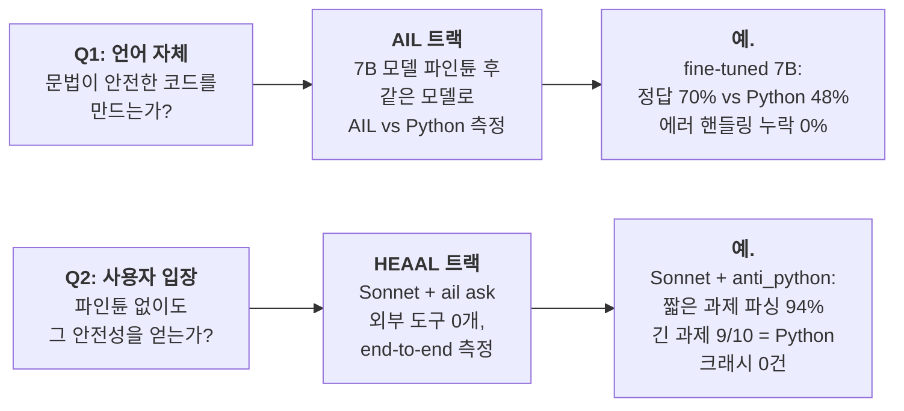
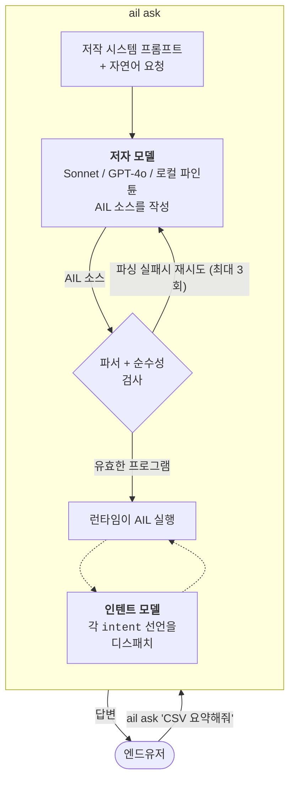
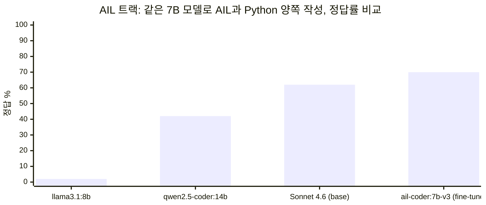
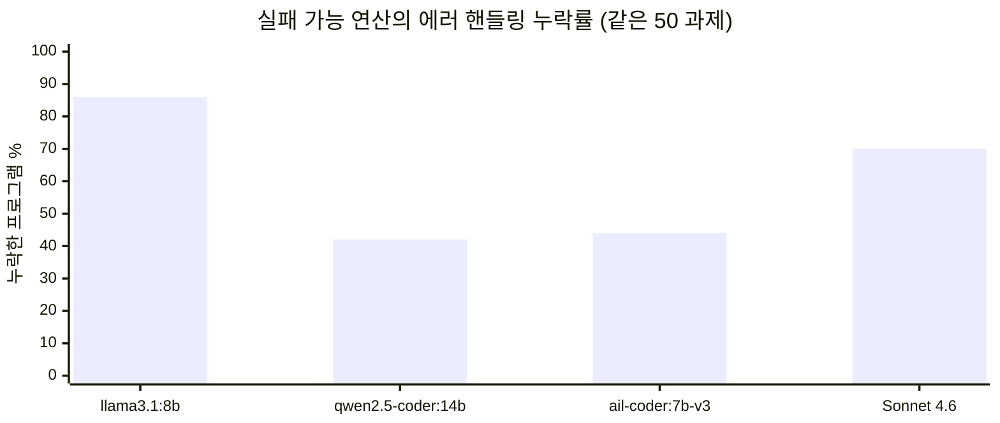

# AIL — AI를 위한 프로그래밍 언어

AI가 코드를 쓰고 사람은 무엇을 원하는지만 말하는 프로그래밍 언어입니다. 키보드 앞의 사람이 아니라 언어 모델이 저자라는 전제로 처음부터 다시 설계됐습니다.

**v1.8.4** · `pip install ail-interpreter` · [English](../../README.md) · [AI/LLM 참조](../../README.ai.md)

> 같은 50개 실제 과제에서, **`ail ask` + Claude Sonnet**은 Python과 동일한 정답률, **크래시 0건, 에러 핸들링 누락 0건** — 파인튠 없이, 외부 하네스 없이.

---

## 2분 요약

다른 사람들은 Python **바깥에** 하네스를 짓습니다 — pre-commit hook, 커스텀 린터, AGENTS.md 파일, 재시도 wrapper, 출력 검증기. AIL은 **문법 안에** 하네스를 넣었습니다. 이게 지금 증명하고 있는 것이고, 프로젝트는 서로 다른 두 질문에 답하는 두 트랙으로 나뉩니다:



AIL 트랙은 언어 연구.
HEAAL 트랙은 그 위에 짓는 첫 프로젝트 — 안전성 이야기가 아무 frontier 모델에도 그대로 옮겨진다는 증명.

> **먼저 읽을 것:** [`docs/ko/heaal.ko.md`](heaal.ko.md) — HEAAL 매니페스토. AIL의 원저자인 Claude Opus 4가 2026년 하네스 엔지니어링 문헌을 검토한 후 작성. HEAAL을 AI 코드 안전성의 3단계(vibe coding → harness engineering → HEAAL)로 포지셔닝. [English 버전](../heaal.md), [AI/LLM용 버전](../heaal.ai.md).

---

## `ail ask`의 동작 방식



LLM 두 개, 역할 두 개. **저자 모델**은 `ail ask` 호출당 한 번 프로그램을 씁니다. **인텐트 모델**은 프로그램 실행 중 `intent`가 나올 때마다 호출됩니다. 같은 API든 다른 API든 언어는 상관 안 합니다 — 안전성은 런타임에 있기 때문입니다.

---

## AIL 프로그램, 한 화면에

```ail
pure fn word_count(s: Text) -> Number {
    return length(split(trim(s), " "))
}

intent classify_sentiment(text: Text) -> Text {
    goal: positive_negative_or_neutral
}

entry main(text: Text) {
    count = word_count(text)               // pure fn  — 로컬 실행, LLM 없음
    label = classify_sentiment(text)       // intent   — 모델로 디스패치
    return join([to_text(count), " 단어, ", label], "")
}
```

두 종류의 함수, 파서가 강제:

- **`pure fn`**은 결정론적. LLM, 파일 I/O, 네트워크 호출 불가. `intent`를 호출하려고 하면 프로그램이 실행조차 안 됩니다.
- **`intent`**는 판단. 런타임이 인텐트 모델로 라우팅해서 `(값, 신뢰도)`를 받습니다.

이 구분은 스타일 관례가 아닌 **문법 규칙**입니다. 안전성이 여기서 옵니다.

---

## 실제로 측정된 결과

### AIL 트랙 — 같은 모델, 두 언어 (50 프롬프트)



파인튜닝한 7B가 강력한 base 모델을 **AIL 작성에서** 이깁니다. 더 중요한 것: **AIL로 작성된 프로그램은 에러 핸들링을 0% 누락**, 같은 모델 Python은 42-86%를 누락합니다:



Python 쪽 그래프입니다. AIL 쪽은 같은 그래프가 전부 0으로 평평합니다. 문법이 `Result` 처리를 강제하기 때문에, 저자 모델이 `to_number`, `perform file.read`, `perform http.get`을 가드 없이 쓰면 프로그램이 파싱되지 않습니다.

### HEAAL 트랙 — `ail ask` + Sonnet, 파인튠 없음, 외부 하네스 없음

**짧은 과제 (E1).** AIL에 기본 내장되는 저작 프롬프트 variant 하나(`anti_python`) 추가. 사용자 쪽 변경 없음.

```mermaid
---
config:
    xyChart:
        width: 900
        height: 380
---
xychart-beta
    title "E1 on Sonnet — anti_python 프롬프트 variant 효과"
    x-axis ["파싱 성공", "정답", "fn/intent 라우팅"]
    y-axis "percent" 0 --> 100
    bar [36, 36, 36]
    bar [94, 88, 94]
```



왼쪽 막대 = default 프롬프트. 오른쪽 막대 = `anti_python` 프롬프트. 같은 모델, 같은 50 프롬프트, 같은 no-harness 조건. 파싱 +58pp, 정답 +52pp.

**Effect가 들어가는 긴 과제 (E2).** `perform http.get`, `perform file.read`, `perform file.write`와 그 조합을 쓰는 10 과제. 같은 Sonnet이 AIL과 Python 양쪽을 작성, 그 사이에 사용자가 추가한 것은 아무것도 없음.

```mermaid
---
config:
    xyChart:
        width: 900
        height: 380
---
xychart-beta
    title "E2 — Sonnet + ail ask vs Sonnet이 Python 작성 (외부 하네스 없음)"
    x-axis ["과제 합격", "프로그램 완주 (크래시 없음)", "에러 핸들링 누락"]
    y-axis "10개 중 개수" 0 --> 10
    bar [9, 10, 0]
    bar [9, 9, 10]
```



왼쪽 막대 = AIL. 오른쪽 막대 = Python. 과제 합격 동률이 중요합니다. AIL은 합격률을 양보하지 않으면서, 프로그램 완주 (크래시 0건)와 에러 핸들링 (누락 0건) 두 항목에서 구조적으로 이깁니다.

**주장을 구체화시키는 딱 한 사례는 E2-10.** 두 프로그램 모두 Wikipedia 요약 URL을 fetch하도록 요청받았습니다. Wikipedia가 HTTP 403을 반환했습니다. Python 프로그램은 try/except 없이(Sonnet은 frontier 티어에서도 70% 비율로 이걸 빼먹습니다) 크래시:

```
urllib.error.HTTPError: HTTP Error 403: Forbidden
```

AIL 프로그램은 같은 모델, 같은 URL에 대해 깔끔히 실행됐습니다. 왜? `perform http.get`이 `Result`를 반환하고, AIL은 Sonnet이 `if is_ok(r)` 검사를 건너뛰게 놔두지 않기 때문입니다 — 그 없이는 프로그램이 파싱되지 않습니다. 문법이 외부 린터가 없어도 잡았습니다.

---

## 바로 써보기

### 경로 A — 갖고 있는 frontier 모델로 (HEAAL)

```bash
pip install 'ail-interpreter[anthropic]'
echo 'ANTHROPIC_API_KEY=sk-ant-...' > .env

ail ask "Hello World의 모음 수를 세줘"
# 3

ail ask "https://httpbin.org/json을 가져와서 slideshow.title을 한국어로 요약해줘"
# 와이드스크린 프레젠테이션 샘플
```

이게 HEAAL 셋업 전부입니다. 환경변수 2개, 파인튠 없음, 추가 도구 없음. Sonnet이 작성하는 모든 프로그램에 문법 보장 안전성이 따라옵니다.

### 경로 B — 로컬 파인튠 (AIL 트랙)

```bash
pip install ail-interpreter
# 로컬에 Ollama 설치 후 파인튠된 어댑터 pull:
ollama pull ail-coder:7b-v3    # 4.7 GB, 2026-04-21 훈련됨

export AIL_OLLAMA_MODEL=ail-coder:7b-v3
ail ask "7의 팩토리얼"
# 5040
```

로컬 인퍼런스 경로. API 비용 없음. Sonnet 직접 호출보다 과제 합격률이 살짝 높지만 안전 속성은 동일.

### AI가 실제로 뭘 썼는지 보기

```bash
ail ask "1부터 100까지 합" --show-source
# 5050
# (stderr) --- AIL ---
# (stderr) pure fn sum_range(start: Number, end: Number) -> Number {
# (stderr)     total = 0
# (stderr)     for i in range(start, end + 1) { total = total + i }
# (stderr)     return total
# (stderr) }
# (stderr) entry main(x: Text) { return sum_range(1, 100) }
```

원하면 `.ail` 소스가 거기 있습니다. 대부분 사용자는 안 볼 겁니다.

---

## 이 설계를 왜 이렇게 잡았나

Python 라이브러리가 강제할 수 없는 세 가지를 AIL 문법이 강제합니다:

1. **`while` 없음.** 무한 루프가 언어 수준에서 불가능. Python SDK는 *권고*만 할 수 있지만 AIL은 *실행을 거부*합니다.
2. **`Result`는 구조적.** 실패 가능한 연산은 전부 `Result[T]`를 반환. `is_ok`/`unwrap_or` 없이 내부 값을 못 씁니다. Python `try/except`는 선택 사항, `Result`는 필수.
3. **`pure fn`은 컴파일 타임 검증.** LLM 호출 없음, effect 없음, 비순수 fn 호출 없음. 그 중 하나라도 본문에 나타나면 파서가 `PurityError`로 거부. Python `@pure` 데코레이터는 사용자가 외부 린터를 설치하지 않으면 못 잡습니다.

차이의 전체 목록 + 실행 가능한 증명: [`docs/why-ail.md`](../why-ail.md).

---

## 버전별 기능

| 버전 | 기능 |
|---|---|
| v1.0 | `fn`, `intent`, `entry`, `if`/`else`, `for`, `branch`, `context`, `import`, `evolve`, `eval_ail` |
| v1.1 | `Result` 타입 — `ok`, `error`, `is_ok`, `unwrap`, `unwrap_or` |
| v1.2 | Provenance — 모든 값이 origin 트리를 가짐 |
| v1.3 | `pure fn` 정적 검증 — intent 호출, effect, 비순수 fn 호출 불가 |
| v1.4 | `attempt` 블록 — confidence 우선순위 캐스케이드 |
| v1.5 | Implicit parallelism — 독립 intent 호출 자동 병렬, async/await 없음 |
| v1.6 | Effects — `perform http.get`, `perform file.read`, `perform file.write` |
| v1.7 | `match` + confidence guard |
| v1.8 | Calibration — 샘플이 쌓이면 confidence가 관측 평균으로 대체 |
| v1.8.3 | 수학 builtin (`round`, `sqrt`, `pow`, …); 파라미터릭 타입 (`List[T]`, `Map[K,V]`) |
| v1.8.4 | 서브스크립트 sugar `expr[i]` → `get(expr, i)` |
| v1.8.5 (dev) | `parse_json` builtin; `ail_parse_check` 자기성찰; `AIL_AUTHOR_PROMPT_VARIANT=anti_python` |

---

## 저장소 지도

```
ail-project/
├── spec/                     # 언어 명세
├── reference-impl/           # Python 인터프리터 (PyPI: ail-interpreter)
│   ├── ail/                  # 파서, 런타임, stdlib
│   ├── examples/             # 16개 예제 프로그램
│   └── training/             # QLoRA 파이프라인 (파인튠 모델용)
├── go-impl/                  # Go 인터프리터 (핵심 기능)
├── docs/
│   ├── heaal/                # HEAAL 트랙 (AIL 위에 짓는 프로젝트)
│   ├── benchmarks/           # 원본 JSON + 분석 문서 — 아래 모든 숫자가 재현 가능
│   ├── why-ail.md            # Python 대비 6가지 구체적 차이
│   └── ko/                   # 한국어 문서
└── benchmarks/
    ├── prompts.json          # 공유 50 프롬프트 코퍼스 (AIL 트랙)
    └── heaal_e2/             # 긴 과제 코퍼스 (HEAAL 트랙)
```

---

## 당신에게 맞나?

**맞습니다, 만약…**
- AI가 생성한 코드를 배포하고 "모델이 에러 핸들링을 제대로 했나?"가 중요한 경우.
- 환경변수 하나 바꿔서 `ail ask`를 시도할 의향이 있는 경우.
- 실패 사례(E2-10) 소스를 읽고 왜 Python 크래시가 구조적인지 알아볼 수 있는 경우.

**아직 아닐 수도 있습니다, 만약…**
- IDE 툴링, LSP, 디버거가 필요한 경우 — AIL에는 아직 없음.
- 이미 린터, CI 체크, 주의 깊은 저자로 잘 하네스된 Python 코드베이스를 갖고 있는 경우. 이미 지어놓은 외부 하네스를 AIL이 대체하는 건데, 한계 가치가 작습니다.
- 과제가 순수 판단 (텍스트 요약만 하면 됨) 인 경우. 그건 그냥 모델 직접 호출. AIL이 추가하는 게 없음.

---

## 기여 & 라이선스

이슈/PR은 영어 한국어 모두 환영. 설계 비판이 코드만큼 값집니다 — [`docs/open-questions.md`](../open-questions.md)에 미해결 설계 질문 17개가 있고 어느 것이든 좋은 시작점입니다.

[`CONTRIBUTING.md`](../../CONTRIBUTING.md) 참조. Apache 2.0 라이선스 ([`LICENSE`](../../LICENSE)).

---

## 만든 사람들

**[hyun06000](https://github.com/hyun06000)** — 사람 저자. 원래 비전, 모든 아키텍처 결정, GitHub에 푸시하는 모든 것.

**Claude Opus 4**가 v1.0을 claude.ai 채팅 인터페이스로, 브라우저 탭에서, git 번들을 복붙하며 작성했습니다. 그 커밋은 v1.0.0 태그까지 `Author: Claude`로 나타납니다.

**Claude Code**가 v1.1부터 현재 브랜치까지 작성 — 언어 기능, Go 런타임, 훈련 파이프라인, 벤치마크, 파인튠된 `ail-coder:7b-v3` 어댑터, HEAAL 실증.

이 프로젝트는 여러 세션에 걸쳐 사라진 AI들과, 그 작업물을 하나하나 확인하고 GitHub에 옮겨준 사람의 협업으로 만들어졌습니다.
