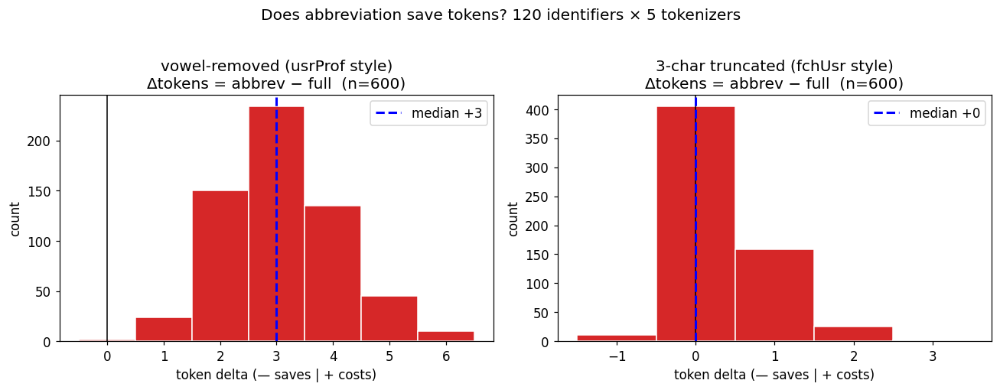
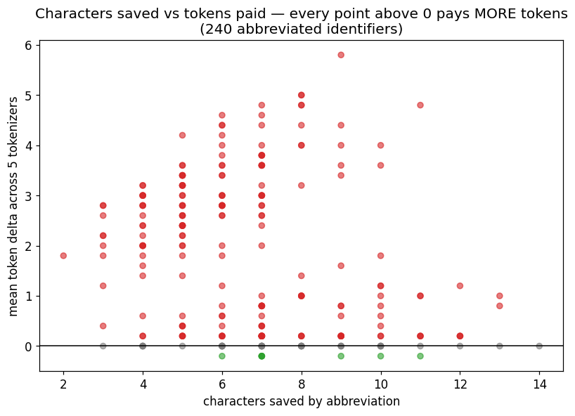

# 축약은 토큰을 절약하는가 — 통계 실측

> gil 사이클 `ail-grammar-skeleton/abbrev-stats` 산출물. 재현: `python3 experiments/tokenizer/abbrev_stats.py`
> 사람의 질문에 대한 답이다: *"축약하면 더 절약하는 거 아닌가? 통계 자료로 시각화해 달라."*

## 0. 실험

식별자 120개(흔한 프로그래밍 어휘 2~3어 camelCase 조합) × 축약 2종 × 토크나이저 5계열 = **1,200 실측**. 추가로 키워드 40쌍(`intent→itt`, `string→str` …) × 5계열 = 200 실측.

- **devowel**: 모음 제거 (`userProfile → usrPrfl`) — 평균 5.7자 절약
- **trunc**: 어절별 3자 절단 (`fetchUser → fetUse`) — 평균 7.8자 절약

## 1. 결과

| | 문자 절약 | 토큰 변화 중앙값 | 절약된 경우 | 동일 | **악화** |
|---|---|---|---|---|---|
| 모음 제거 | −5.7자 | **+3** | **0%** (0/600) | 0% | **100%** |
| 3자 절단 | −7.8자 | +0 | 2% | 68% | 31% |
| 키워드 축약 40쌍 | — | +0 | 1% | 68% | 31% |

산점도의 모든 점이 0선 위이거나 0선에 있다 — **문자를 아무리 절약해도 토큰이 내려가는 지점이 없다.** 5계열 전부 같은 방향(o200k 악화율 98%~phi3 100%, devowel 기준).

## 2. 왜 이런가 — 직관을 세우는 설명

토크나이저(BPE)의 어휘는 실제 코퍼스 빈도로 만들어진다. 그 결과:

1. **온전한 영어 단어는 이미 1토큰이다.** `string`도 1토큰, `str`도 1토큰 — 축약해도 **내려갈 자리가 없다** (토큰의 하한은 1). 키워드 40쌍에서 절약이 1%뿐인 이유. `config→cfg`, `index→idx`처럼 코퍼스에 흔한 관용 축약조차 이득이 0이다.
2. **신조 축약은 어휘 밖이다.** `usrPrfl`의 `Prfl` 같은 조각은 코퍼스에 없으므로 문자 단위로 쪼개진다 — 그래서 모음 제거는 문자를 5.7자 줄이고 토큰을 **3개 더 낸다**.
3. 따라서 축약은 **비대칭 내기다: 얻을 수 있는 것은 0, 잃을 수 있는 것은 +2~3.** 3자 절단이 "68% 동일"인 것은 절단형(`fet`, `use`)이 우연히 어휘에 있을 때이고, 그때조차 이득이 아니라 본전이다.

> 요약: "짧게 쓰면 절약"은 **문자 경제**의 직관이다. LLM은 문자가 아니라 토큰을 세고, 토큰 어휘는 온전한 단어 중심으로 이미 최적화되어 있다. 절약하고 싶다면 단어를 줄이는 게 아니라 **단어 수 자체를 줄여야** 한다(의례 제거 — [tokenizer-survey.md](tokenizer-survey.md) 원칙 7).

## 3. 원칙 1의 정밀화 (refines)

사이클 ①의 "축약 금지"는 유지하되 근거가 정밀해졌다:

- 신조 축약(모음 제거·절단): **금지** — 100%/31% 악화, 절약 사례 실질 0
- 관용 축약(`str`,`cfg`,`idx`…): 금지할 필요까진 없으나 **이득이 0**이므로, 가독성 아닌 토큰을 이유로 채택할 근거가 없다 → AIL 표준 어휘는 온전한 단어로 통일

## 4. 한계

- 식별자 단독 측정이다. 문장/코드 문맥 안에서는 앞뒤 토큰과의 병합으로 ±1 흔들릴 수 있으나, 방향(절약 없음)을 뒤집을 크기가 아니다.
- 축약이 유리해지는 유일한 시나리오는 "그 축약이 대량 반복되어 컨텍스트 내 코드북으로 학습되는 경우"인데, 이는 표기가 아니라 전략의 문제다 — [token-strategies.md](token-strategies.md) §3 참고.
